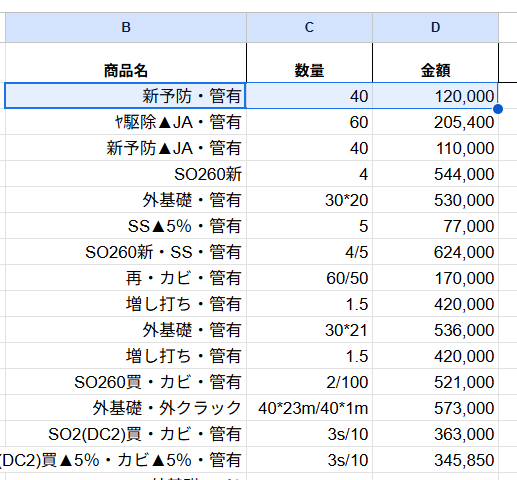
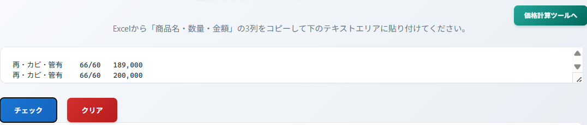

# 価格計算アプリ & リバースチェックツール

## 🌐 アプリケーション概要

このプロジェクトは、価格計算業務を効率化するための2つのWebアプリケーションを提供します。

- **価格計算表**: 商品の価格計算と見積もり作成
- **逆計算チェックツール**: Excelデータの検証と逆算チェック

### 🔗 アクセス方法

- **メインページ**: https://0046-shun.github.io/calculation/
- **価格計算表**: https://0046-shun.github.io/calculation/Calculation.html
- **逆計算チェック**: https://0046-shun.github.io/calculation/ReverseCheck.html

---

## 📊 価格計算表 (Calculation.html)

### 主要機能

1. **商品選択システム**
   - 大項目・小項目の階層選択
   - 通常商品と基礎商品のタブ切り替え

2. **計算機能**
   - 数量 × 単価の自動計算
   - 値引き金額の適用
   - 税込・税抜価格の同時表示

3. **管理機能**
   - 一般管理費 (20,000円) のON/OFF
   - 最大5商品まで追加可能
   - 合計金額の自動計算

### 使用方法

#### ステップ1: 商品選択
```
1. タブから「通常商品」または「基礎商品」を選択
2. 「大項目選択」から商品カテゴリを選択
3. 「小項目選択」から具体的な商品を選択
```


#### ステップ2: 数量・値引き設定
```
1. 「数量」フィールドに必要数を入力
2. 「値引」フィールドに値引き額を入力（任意）
```

#### ステップ3: 計算実行
```
1. 「計算」ボタンをクリック
2. 税抜・税込価格が自動表示される
3. 選択された商品が上部の「選択された商品」リストに追加される
```


#### ステップ4: 商品追加（必要に応じて）
```
1. 「商品フォーム追加」ボタンで新しい商品フォームを追加
2. 最大5商品まで同時計算可能
```
──────────────────────────────────┘
```

## 🔄 逆計算チェックツール (ReverseCheck.html)

### 主要機能

1. **Excelデータ連携**
   - Excelから「商品名・数量・金額」をコピー&ペースト
   - タブ区切りデータの自動解析


2. **逆算検証**
   - 入力された金額の逆算チェック
   - 単価データベースとの照合
   - 計算誤差の検出

```
### 使用方法
### 初期画面

```
#### ステップ1: Excelデータの準備
```
Excel形式:
商品名    数量    金額
商品A     2      10000
商品B     3      15000
```

#### ステップ2: データの貼り付け
```
1. Excelで「商品名・数量・金額」の3列を選択
2. Ctrl+C でコピー

3. テキストエリアにCtrl+V で貼り付け

```

#### ステップ3: チェック実行
```
1. 「チェック」ボタンをクリック
2. 結果が下部に表示される
3. 貼り付け情報とシステム計算が一致すれば緑色
4. 貼り付け情報とシステム計算が不一致ならば赤色


## 🛠️ 技術仕様

### 使用技術
- **フロントエンド**: HTML5, CSS3, JavaScript (ES6+)
- **スタイリング**: レスポンシブデザイン対応
- **データ**: data.js による商品データ管理

### ファイル構成
```
calculation/
├── index.html              # ランディングページ
├── Calculation.html        # 価格計算表
├── Calculation.css         # 価格計算表スタイル
├── script.js              # 価格計算ロジック
├── ReverseCheck.html      # 逆計算チェックツール
├── ReverseCheck.css       # 逆計算チェックスタイル
├── reverse_check.js       # 逆計算チェックロジック
├── data.js               # 商品データベース
└── README.md             # このドキュメント

```

### ブラウザ対応

---
- Chrome 80+
- Firefox 75+
- Safari 13+
- Edge 80+

---

## 📝 よくある質問 (FAQ)

### Q1: 商品が表示されない
**A**: data.jsファイルに商品データが正しく設定されているか確認してください。

### Q2: 計算結果がおかしい
**A**: 数量と値引き額が正しく入力されているか確認してください。

### Q3: Excelデータが正しく認識されない
**A**: データが「商品名・数量・金額」の順番でタブ区切りになっているか確認してください。

### Q4: 管理費をオフにしたい
**A**: 「一般管理費」のチェックボックスを外してください。

---

## 🔧 カスタマイズ

### 商品データの追加・編集
`data.js`ファイルを編集することで、商品データをカスタマイズできます：

### スタイルのカスタマイズ
CSSファイルを編集することで、デザインをカスタマイズできます：
- `Calculation.css`: 価格計算表のスタイル
- `ReverseCheck.css`: 逆計算チェックツールのスタイル

---

## 📞 サポート

問題や要望がございましたら、担当者までお申し付けください
---

## 📄 ライセンス

このプロジェクトはMITライセンスの下で公開されています。

---

*最終更新: 2025年* 